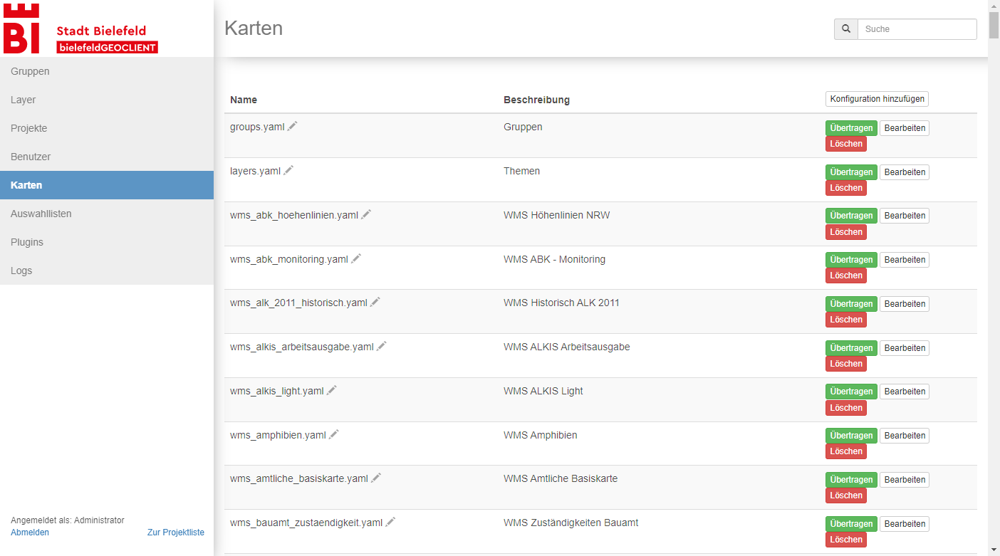
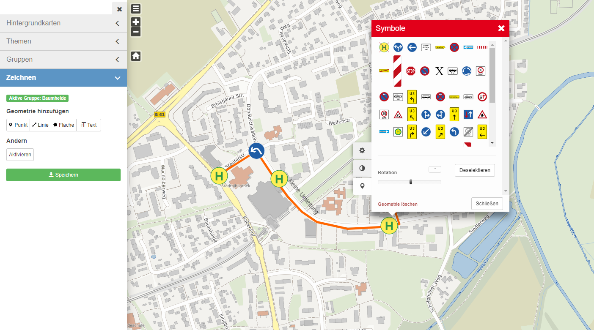

# bielefeldGEOCLIENT / Munimap

Munimap is an interactive online map with a plenty of abilities. Define theme based layer groups, restrict access to allowed users, export map extracts, digitize features (beta), integration in Form-Solutions formular software for building a citizen service portal and many more.

> **bielefeldGEOCLIENT presentation on FOSSGIS 2022! https://pretalx.com/fossgis2022/talk/8EYN7H/**

## Features

* Easy configuration using yaml files

* Highly customizable application

* Create multiple theme based online maps by configuration

* Easy to use layerswitcher with multiple background- and groupable theme layers

* Context-based information by right-clicking the map

* Possibility to serve metadata with every layer

* Customizable feedback function

* Integration of third party applications with optional token based access restrictions


* Ability to export map extract into multiple formats using mapfish print v3

* Export map extract with street index and adjustable grid cells


* Measurement

* Saving map configuration to exchangeable json files

* Powerful administration tools (users, maps, groups, layers, access rights, geoEDITOR plugins and selections lists, logs)



* Integration in Form-Solutions formular software for building a citizen service portal with geo functionality


## Addons

### Munimap Digitize (beta status)

Adds ability to create and publish extra data.

[//]: # (TODO update screenshot to fit new layout)


#### Features

* Customize editing surface with Munimap application configuration

* Publish data time-based

### Munimap Transport

Turns Munimap into an interactive journey planner.

#### Features

* Link to your local transport service provider

## Current status

### Missing

## Installation

### Dependencies

* docker
* docker-compose version >= 1.29

### Building production containers


Go to the `docker` directory and build the containers (this may take several minutes):
```
docker-compose --profile prod build
```

### Initializing databases

The databases need to be initialized, again from the `docker` directory:
```
docker-compose --profile prod up munimap-postgis munimap-postgis-mapbender
```
When the message `database system is ready to accept connections` is displayed the initialization is complete, and the containers can be stopped with `ctrl+c`.

## Start

Go to the `docker` directory and start the application:
```
docker-compose --profile prod up
```
After everything loaded up you can reach the application at `http://localhost`. The admin interface is found under
`http://localhost/admin` and by default the admin user is named `verwalter` and has the password `verwalter`.

## Documentation

Documentation can be found on
https://stadt-bielefeld.github.io/bielefeldGEOCLIENT

## Development

To learn how to configure a dev-environment please refer to the [readme for developers](./dev/README.md)

The source code is available at: https://github.com/stadt-bielefeld/bielefeldGEOCLIENT

You can report any issues at: https://github.com/stadt-bielefeld/bielefeldGEOCLIENT/issues
