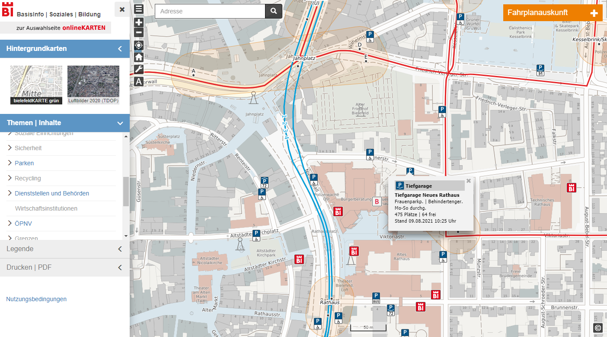
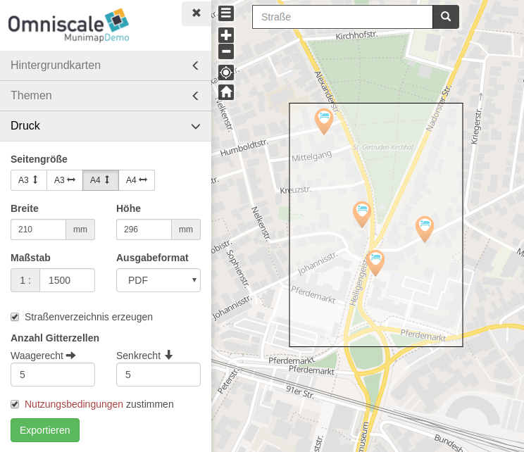

# bielefeldGEOCLIENT / Munimap

Munimap is an interactive online map with ability to export map extract.

[TODO ADD LICENSE]

## Features

* Easy configuration using yaml files

* Highly customizable application

* Create multiple theme based online maps by configuration

* Easy to use layerswitcher with multiple background- and groupable theme layers

* Ability to export map extract into multiple formats using mapfish print v3

* Export map extract with street index

* Measurement

## Addons

### Munimap Digitize

Adds ability to create and publish extra data.

#### Features

* Customize editing surface with Munimap application configuration

* Manage editor users and groups by a simple yaml file

* Publish data time-based

### Munimap Transport

Turns Munimap into an interactive journey planner.

#### Features

* Transport routes based on based on [OpenStreetMap](http://www.openstreetmap.org) data

* Link to your local journey planner

## Current status

### Missing

## Installation

#### Dependencies

You need

* Postgresql >= 9.4
* PostGIS >= 2.1
* Mapfish Print >= 3.3
* Python = 2.6
* Virtualenv >= 4.3

### Munimap

See dev/README for install instructions for munimap, munimap_digitize and munimap_transport

## Start

See dev/README for starting instructions

## Documentation

Will be coming soon.

## Development

The source code is available at: TODO

You can report any issues at: TODO
